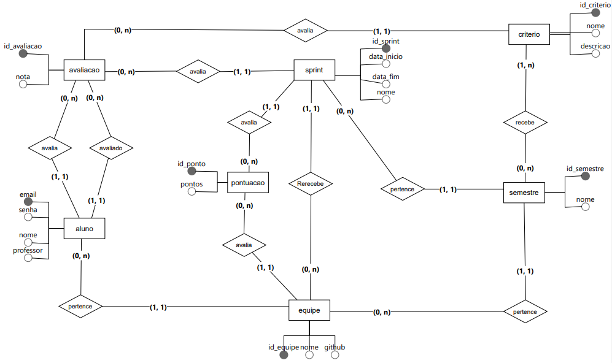

<!DOCTYPE html>
<html lang="pt-br">
<head>
    <meta charset="UTF-8">
    <meta name="viewport" content="width=device-width, initial-scale=1.0">
</head>
<body>

    

 

# Planejamento das Sprints

Sprint 1

## User Stories da Sprint

| Rank | Prioridade | ID | User Story | Estimativa | Sprint | Requisito do parceiro |
|------|------------|----|------------|------------|--------|-----------------------|
| 1 |  ALTA | PAS - 02  | Como um professor, eu quero criar um grupo e importar um arquivo .csv para salvar as informações dos alunos que fazem parte desse grupo para que eu possa gerenciar os dados dos integrantes de forma rápida e organizada. | 1 | 1 | 4 |

### Requisitos
- O professor deve poder importar um arquivo CSV com as informações Nome, e-mail e senha.
- Deve haver uma validação para garantir que o formato do arquivo esteja correto.
- Em caso de erro no arquivo CSV, uma mensagem de erro deve ser exibida para o professor.

### Defitionion of done: 
- Código funcional e organizado, disponibilizado no Github.
- Layout para criação e gerenciamento de grupo definido e implementado.
- Funcionalidade de importação de arquivo .csv integrada e testada.
- Funcionalidade totalmente integrada ao sistema.

### Definition of ready: 
- User story claramente definido, incluindo critérios de aceitação.
- Estrutura do arquivo .csv terá os campos nome, e-mail e senha.
- wireframe de gerenciamento de grupo: 

## Validações feitas com o Cliente

| Validações                                                              | Respostas                                                                       |
|-------------------------------------------------------------------------|---------------------------------------------------------------------------------|
Em relação aos grupos que realizarão as sprints, além dos integrantes e do nome do grupo, há mais alguma informações que deseja vincular a esses grupos? | link do git |
| O professor será o único a cadastrar os alunos ou ele pode liberar um acesso para que o próprio aluno faça o seu cadastro? | o professor cadastra |
| Seria interessante então poder cadastrar vários professores? | A princípio só tem 1 |
| Podemos criar tela para cadastrar os alunos individualmente?  |	Pode, mas a prioridade para isso é baixa pois a forma principal de cadastro deve ser por importação de arquivo |

---

| Rank | Prioridade | ID | User Story | Estimativa | Sprint | Requisito do parceiro |
|------|------------|----|------------|------------|--------|-----------------------|
| 2 |  ALTA | PAS - 08  | Como um professor, eu quero criar semestres para dividir os grupos e organizar as equipes, de forma a facilitar a gestão e o acompanhamento do progresso dos alunos na API. | 1 | 1 | 5 |

### Requisitos
- O professor, quando for criar o semestre, deve selecionar quais critérios serão avaliados no semestre.
- O professor pode criar quantos semestres quiser e pode renomea-los quando desejar
- Deve ser possível associar grupos a um semestre específico.
- O professor deve ser capaz de visualizar todos os semestres criados e os grupos associados a ele.

### Defitionion of done: 
- Código funcional e organizado, disponibilizado no Github.
- Layout para criação e gerenciamento de grupo definido e implementado.
- Funcionalidade totalmente integrada ao sistema.

### Definition of ready: 
- User story claramente definido, incluindo critérios de aceitação.
- No cadastro do semestre deve ser inserido o nome e os critérios que já foram cadastrados a serem avaliados.
- wireframe da criação de semestre: 

## Validações feitas com o Cliente

| Validações                                                              | Respostas                                                                       |
|-------------------------------------------------------------------------|---------------------------------------------------------------------------------|
| Seria de seu interesse separar os grupos por turmas? Por exemplo, "Grupos do 2º Semestre de Banco de Dados 2024" | sim, preciso separar por semestre/turma |
| Em relação ao professor que vai acessar ao sistema, ele vai ter acesso a todos os grupos dos alunos de várias turmas diferentes ou somente os grupos de uma turma específica? | Por semestre ele vai ter acesso a somente uma turma, mas no semestre seguinte a turma será diferente (a não ser que todo mundo reprove) |

  ---
  
| Rank | Prioridade | ID | User Story | Estimativa | Sprint | Requisito do parceiro |
|------|------------|----|------------|------------|--------|-----------------------|
| 3 |  ALTA | PAS - 14 | Como um aluno, eu quero dar notas para todos os integrantes da minha equipe para avaliar a contribuição de cada um no desenvolvimento da API | 3 | 1 | 1 |

### Requisito: 
- O aluno deve ser capaz de selecionar cada integrante da equipe e atribuir uma nota para cada critério avaliado.
- A nota deve ser de 0 a 3.
- Uma mensagem de confirmação deve ser exibida após a atribuição de notas.
- O aluno não deve poder avaliar mais de uma vez por sprint.

### Defitionion of done: 
- Código funcional e organizado, disponibilizado no Github.
- Layout para avaliação do aluno definido e implementado.
- Funcionalidade totalmente integrada ao sistema.

### Definition of ready: 
- User story claramente definido, incluindo critérios de aceitação.
- Na avaliação do aluno, avaliaremos um aluno por página aonde será listado todos os critérios e aonde há uma choicebox para a seleção da nota.
- wireframe da avaliação do aluno: 

| Validações | Respostas |
|------------|-----------|
| Há uma pontuação máxima que o professor disponibilizará para a Sprint?| O máximo é se todo mundo puder dar 3 em todos os critérios para todo mundo.|

---
  
| Rank | Prioridade | ID | User Story | Estimativa | Sprint | Requisito do parceiro |
|------|------------|----|------------|------------|--------|-----------------------|
| 4 |  ALTA | PAS - 12 | Como um professor, eu quero estabelecer um limite de pontos para as sprints dos grupos para que os integrantes possam usar esses pontos para avaliar uns aos outros | 3 | 1 | 1 |

### Requisitos: 
- O professor deve ser capaz de definir um limite máximo de pontos da sprint para cada grupo.
- O sistema deve garantir que os pontos distribuídos pelos alunos não excedam o limite estabelecido.
- Uma mensagem de erro deve ser exibida caso o limite de pontos seja excedido durante a avaliação.

### Defitionion of done: 
- Código funcional e organizado, disponibilizado no Github.
- Layout para avaliação do aluno definido e implementado.
- Funcionalidade totalmente integrada ao sistema.

### Definition of ready: 
- User story claramente definido, incluindo critérios de aceitação.
- Na pontuação da sprint, o professor deve selecionar qual semestre e sprint vai avaliar e o sistema deve listar todas as equipes desse semestres com um caixa de texto que deve ser preenchida com a pontuação.
- Limite de pontuação é 3 vezes o total de integrantes no grupo multiplicado pelo total de critérios do semestre ( 3 * Quantidade de integrantes do grupo * Quantidade de critérios avaliados)
- wireframe da avaliação do aluno: 

---

| Rank | Prioridade | ID | User Story | Estimativa | Sprint | Requisito do parceiro |
|------|------------|----|------------|------------|--------|-----------------------|
| 5 |  ALTA | PAS - 16 | Como um aluno ou professor, eu quero acessar o sistema com meu e-mail e senha para que eu possa avaliar os outros integrantes do meu grupo em todos os critérios | 1 | 1 | 8 |

### Requisitos: 
- O usuário deve poder inserir seu e-mail e senha para autenticar no sistema.
- Deve haver validação para garantir que o e-mail e senha estejam corretos.
- Se as credenciais estiverem incorretas, uma mensagem de erro deve ser exibida.

### Defitionion of done: 
- Código funcional e organizado, disponibilizado no Github.
- Layout para avaliação do aluno definido e implementado.
- Funcionalidade totalmente integrada ao sistema.

### Definition of ready: 
- User story claramente definido, incluindo critérios de aceitação.
- No login, o usuario deve digitar o login e senha para acessar a sua conta
- wireframe da tela de login: 

## Validações feitas com o Cliente

| Validações                                                              | Respostas                                                                       |
|-------------------------------------------------------------------------|---------------------------------------------------------------------------------|
|Todo mundo que for usar o sistema vai ter que se identificar para entrar e usar o sistema. Essa identificação inicial eu e meu time achamos interessante usar um e-mail e senha. O que você acha? | Pode ser |
| Qual informação o professor já deve visualizar ao fazer o login? | Ele já deve acessar diretamente em gerar relatórios.|
| Faz sentido manter um botão de lembrar-me na tela de login? | Não porque o sistema vai ser instalado em computadores públicos |
| Nós já combinamos que é interessante que, ao abrir o sistema, o professor visualize a tela de exportação de relatórios. No caso dos alunos, além da avaliação de sprint, há alguma outra função que eles devem acessar? E qual tela eles devem visualizar logo ao fazer o login? | O aluno só avalia. Fora do período de avaliação pode deixar sem nada ou mostrar o resultado final do grupo (as médias) |

---

| Rank | Prioridade | ID | User Story | Estimativa | Sprint | Requisito do parceiro |
|------|------------|----|------------|------------|--------|-----------------------|
| 6 |  ALTA | PAS - 18 | Como um professor, eu quero criar e editar critérios de avaliação para que os alunos possa se avaliar no final de cadas Spint. | 1 | 1 | 6 |

### Requisitos: 
- O professor deve ser capaz de criar novos critérios de avaliação, especificando título e descrição.
- Deve ser possível editar critérios existentes e salvar as alterações.
- Deve haver a opção de excluir critérios de avaliação, com uma mensagem de confirmação antes da exclusão.

### Defitionion of done: 
- Código funcional e organizado, disponibilizado no Github.
- Layout para avaliação do aluno definido e implementado.
- Funcionalidade totalmente integrada ao sistema.

### Definition of ready: 
- User story claramente definido, incluindo critérios de aceitação.
- No cadastro do critério de avaliação, o professor deve informar o nome do critério e uma breve descrição
- wireframe de gerenciamento de critério: 

## Validações feitas com o Cliente

| Validações                                                              | Respostas                                                                       |
|-------------------------------------------------------------------------|---------------------------------------------------------------------------------|
| Em relação aos critérios que o professor vai colocar na avaliação do aluno, há um limite máximo para a quantidade de critérios? | A princípio não|

---

### Burndown

Sprint 2

## User Stories da Sprint

| Rank | Prioridade | ID | User Story | Estimativa | Sprint | Requisito do parceiro |
|------|------------|----|------------|------------|--------|-----------------------|
| 7 |  ALTA | PAS - 04 | um professor, eu quero poder adicionar, remover ou modificar membros de um grupo de alunos para garantir que cada grupo tenha a composição correta do grupo da API. | 1 | 2 | 7 |

### Requisitos: 
- O professor deve poder adicionar um aluno com nome, e-mail e senha.
- O professor deve poder editar um aluno com nome, e-mail e senha.
- O professor deve poder excluir um aluno cadastrado.
- Deve ser possível o professor verificar e selecionar todos os grupos cadastrados no sistema.

### Defitionion of done: 
- Código funcional e organizado, disponibilizado no Github.
- Layout para avaliação do aluno definido e implementado.
- Funcionalidade totalmente integrada ao sistema.

### Definition of ready: 
- User story claramente definido, incluindo critérios de aceitação.
- No gerenciamento do aluno será feito no gerenciamento do grupo, aonde podemos adicionar ou remover o aluno. Devemos informar o nome, e-mail e senha.
- wireframe de gerenciamento do aluno: 

---

| Rank | Prioridade | ID | User Story | Estimativa | Sprint | Requisito do parceiro |
|------|------------|----|------------|------------|--------|-----------------------|
| 8 |  ALTA | PAS - 09 | Como um professor, eu quero criar e gerenciar sprints para que os alunos possam avaliar de forma sistemática o desempenho dos integrantes do grupo.| 2 | 2 | 8 |

### Requisitos: 
- O professor deve poder criar diversas sprints.
- O professor deve vincular a sprint criada a um semestre.
- O professor deve poder visualizar as sprints criadas.

### Defitionion of done: 
- Código funcional e organizado, disponibilizado no Github.
- Layout para avaliação do aluno definido e implementado.
- Funcionalidade totalmente integrada ao sistema.

### Definition of ready: 
- User story claramente definido, incluindo critérios de aceitação.
- No cadastro da sprint o professor deve informar para qual semestre está cadastrando a sprint, qual o nome, data de início e data de término da sprint.
- wireframe de gerenciamento do aluno: 

## Validações feitas com o Cliente

| Validações | Respostas |
|------------|-----------|
| Prefere definir as datas das sprints ao cadastrar o semestre ou em uma tela separada?| Tanto faz.|
| As datas definidas para as sprints serão para todos os projetos (turmas) ou individualmente para cada um?| Todo semestre muda.|
| Em relação a nota do aluno, todos os integrantes, incluindo ele mesmo, vão avaliar. Se por exemplo um grupo com 3 alunos, um em especifico recebeu duas notas 3 e uma nota 1, a média que será exibida será arredondada ou a nota será com casas decimais? Caso arredonde, qual a regra para arredondar? | Arredondado para 1 casa. Arredondamento normal |

---

### Burndown

Sprint 3

### User Stories da Sprint

| Rank | Prioridade | ID | User Story | Estimativa | Sprint | Requisito do parceiro |
|------|------------|----|------------|------------|--------|-----------------------|
| 9 |  ALTA | PAS - 36 | Como um professor, eu quero cadastrar e gerenciar o calendário das sprints para planejar as datas de início e término de cada sprint, garantindo que os alunos possam se organizar e cumprir os prazos estabelecidos. | 5 | 3 | 1 |

### Requisitos 
- O professor deve poder cadastrar um calendário importando um arquivo .CSV com todas as sprints que haverão no semestre.
- O professor deve vincular as sprints cadastradas a um semestre.
- O professor deve poder visualizar as sprints criadas.

### Defitionion of done: 
- Código funcional e organizado, disponibilizado no Git.
- Documento de instalação atualizado.
- Layout de exibição definido e implementado.
- Layout de importação definido e implementado.
- Funcionalidade totalmente integrada ao sistema.

### Definition of ready: 
- A origem e destino dos dados para o calendário das sprints está identificada e os dados estão corretamente integrados ao banco.
- Os dados inseridos pelo professor são para cadastrar as sprints são nome, data de inicio e data de fim.
- User storie revisada para garantir que os requisitos estão claros.
- O layout da interface para cadastro e gerenciamento do calendário das sprints foi finalizado.
- Wireframe: 

## Validações feitas com o Cliente

| Validações | Respostas |
|------------|-----------|
| Gostaria de saber quanto tempo um aluno terá para avaliar os integrantes da equipe após o professor designar o limite de pontos | Pode ser 7 dias|

---

| Rank | Prioridade | ID | User Story | Estimativa | Sprint | Requisito do parceiro |
|------|------------|----|------------|------------|--------|-----------------------|
| 10 |  BAIXO | PAS - 26 | Como um aluno, eu quero visualizar a nota média de todos os integrantes do meu grupo para compreender o desempenho geral e identificar áreas onde podemos melhorar como equipe. | 3 | 3 | 3 |

### Requisitos 
- A tela que demonstra as notas médias deve ser a primeira a aparecer para o aluno ao fazer o login juntamente a opção de avaliar os outros integrantes da equipe.
- O aluno deve apenas ver as notas médias dos outros alunos de sua equipe.
- Quando estiver no período de avaliação da Sprint, deve haver um botão para avaliar os integrantes do grupo na mesma tela.

### Defitionion of done: 
- Código funcional e organizado, disponibilizado no Git.
- Layout de exibição definido e implementado.
- Funcionalidade totalmente integrada ao sistema.
- Documento de instalação atualizado.

### Definition of ready: 
- O layout da interface inicial aonde o aluno vosualiza a nota média dos integrantes do grupo foi finalizado.
- As notas dos demais alunos do grupo estão claramente exibir e organizadas de objetiva.
- A interface onde os alunos irão visualizar as notas foi finalizada e está de fácil entendimento.
- A user story foi revisada para garantir que os requisitos estão claros e de acordo com as expectativas dos usuários.
- Wireframe: 

---

| Rank | Prioridade | ID | User Story | Estimativa | Sprint | Requisito do parceiro |
|------|------------|----|------------|------------|--------|-----------------------|
| 11 |  BAIXO | PAS - 28  | Como um aluno, eu quero visualizar minhas notas médias para cada critério de avaliação para entender meu desempenho em áreas específicas e identificar onde posso melhorar. | 3 | 3 | 2 |

### Requisitos: 
- Deve aparece no menu inicial demonstrando a nota média de cada critério de forma clara.

### Defitionion of done: 
- Código funcional e organizado, disponibilizado no Git.
- Layout de exibição definido e implementado.
- Funcionalidade totalmente integrada ao sistema.

### Definition of ready: 
- O layout da interface inicial aonde o aluno vosualiza a nota média dos integrantes do grupo foi finalizado.
- As notas do próprio aluno estão claramente exibir e organizadas de objetiva.
- A interface onde os alunos irão visualizar as notas foi finalizada e está de fácil entendimento.
- A user story foi revisada para garantir que os requisitos estão claros e de acordo com as expectativas dos usuários.
- Wireframe: 

---

### Burndonw

Sprint 4

### User Stories da Sprint

| Rank | Prioridade | ID | User Story | Estimativa | Sprint | Requisito do parceiro |
|------|------------|----|------------|------------|--------|-----------------------|
| 12 | MEDIO | PAS - 22  | Como um professor, eu quero gerar um relatório com a nota média de todos os alunos de um grupo para acompanhar o desempenho geral da turma.| 2 | 4 | 2 |

### Requisitos: 
- O professor deve poder gerar o relatório com o mínimo de clicks possível.
- A tela de exportação de arquivo deve ser a primeira tela que o professor irá visualizar ao acessar o sistema.
- O professor deve poder gerar quantos arquivos quiser.
- O professor deve poder filtrar os grupos do relatório por semestre.

### Definition of done:
- Código funcional disponibilizado no Git.
- Documento de instalação atualizado.
- Layout definido e implementado.
- Validação de dados realizada e tratada.
- Funcionalidade totalmente integrada ao sistema.

### Definition of ready: 
- As notas serão arredodadas para cima caso a casa decimal sejá 5 ou superior e arredondado para baixo caso seja menor que 5.
- O layout do relatório e os dados que ele deve conter foram detalhados.
- A interface onde o professor solicitará e visualizará o relatório foi finalizada.
- A origem dos dados que serão usados para gerar o relatório estão identificados.
- Os dados necessários para calcular as notas médias dos alunos estão disponíveis no banco de dados.
- User storie revisada para garantir que os requisitos estão claros.
- Wireframe: 
  

---

| Rank | Prioridade | ID | User Story | Estimativa | Sprint | Requisito do parceiro |
|------|------------|----|------------|------------|--------|-----------------------|
| 13 | MEDIO | PAS - 24  | Como um professor, eu quero gerar um relatório com a nota média por aluno para cada critério, para que eu possa avaliar o desempenho individual dos alunos em áreas específicas." | 2 | 4 | 3 |

### Requisitos: 
- O professor deve poder gerar o relatório com o mínimo de clicks possível.
- A tela de exportação de arquivo deve ser a primeira tela que o professor irá visualizar.
- O professor deve poder gerar quantos arquivos quiser.
- O professor deve poder filtrar os alunos do relatório por turma.

### Definition of done:
- Código funcional e organizado, disponibilizado no Git.
- Documento de instalação atualizado.
- Layout definido e implementado.
- Validação de dados realizada e tratada.
- Funcionalidade totalmente integrada ao sistema.

### Definition of ready: 
- As notas serão arredodadas para cima caso a casa decimal sejá 5 ou superior e arredondado para baixo caso seja menor que 5.
- O layout do relatório e os dados que ele deve conter foram detalhados.
- A interface onde o professor solicitará e visualizará o relatório foi finalizada.
- A origem dos dados que serão usados para gerar o relatório estão identificados.
- Os dados necessários para calcular as notas médias dos alunos estão disponíveis no banco de dados.
- User storie revisada para garantir que os requisitos estão claros.
- Wireframe: 

---

| Rank | Prioridade | ID | User Story | Estimativa | Sprint | Requisito do parceiro |
|------|------------|----|------------|------------|--------|-----------------------|
| 14 |  BAIXO | PAS - 33 | Como um professor, eu quero poder mudar minha senha através do e-mail para que eu possa recuperar o acesso à minha conta de forma segura e conveniente caso eu esqueça minha senha atual. | 4 | 4 | 8 |

### Requisitos
- Deve ser apenas um botão na tela de login
- A pessoa deve informar o e-mail que a senha será alterada
- E-mail de recuperação que será enviado para usuario deve ser gerado automaticamente e nele deve conter um link para alterar senha

### Definition of done: 
- Código funcional e organizado, disponibilizado no Git.
- Layout integrado na tela de login.
- Funcionalidade totalmente integrada ao sistema.
- Documento de instalação atualizado.

### Definition of ready: 
- O cadastro dos usuários já está funcionando e integrado ao banco de dados.
- O texto exibido no e-mail é "Clique no link para recuperar a senha"
- O e-mail de recuperação será enviado do e-mail sistemarecap@gmail.com
- A user story foi revisada para garantir que os requisitos estão claros e de acordo com as expectativas dos usuários.
- Wireframe do botão de "Esqueci a senha": 
  
- Wireframe de tela que pedirá informações pra redefinir a senha: 

---

| Rank | Prioridade | ID | User Story | Estimativa | Sprint | Requisito do parceiro | 
|------|------------|----|------------|------------|--------|-----------------------|
| 15   |  BAIXO      | PAS - 34  | Como um aluno, eu quero poder mudar minha senha através do e-mail para que eu possa recuperar o acesso à minha conta de forma segura e conveniente caso eu esqueça minha senha atual.     | 4          | 4      | 8 |

### Requisitos
- Deve ser apenas um botão na tela de login
- A pessoa deve informar o e-mail que a senha será alterada
- E-mail de recuperação que será enviado para usuario deve ser gerado automaticamente e nele deve conter um link para alterar senha

### Definition of done: 
- Código funcional e organizado, disponibilizado no Git.
- Layout integrado na tela de login.
- Funcionalidade totalmente integrada ao sistema.
- Documento de instalação atualizado.

### Definition of ready: 
- O cadastro dos usuários já está funcionando e integrado ao banco de dados.
- O texto exibido no e-mail é "Clique no link para recuperar a senha"
- O e-mail de recuperação será enviado do e-mail sistemarecap@gmail.com
- A user story foi revisada para garantir que os requisitos estão claros e de acordo com as expectativas dos usuários.
- Wireframe do botão de "Esqueci a senha": 
  

- Wireframe de tela que pedirá informações pra redefinir a senha: 

### Burndown

---

# Diagrama de entidades de relacionamento do banco de dados

 

    

</body>
</html>
